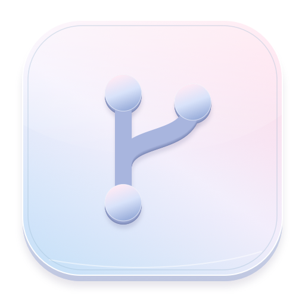
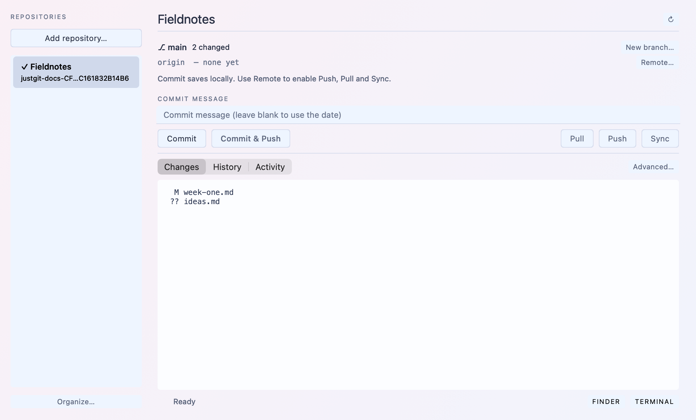
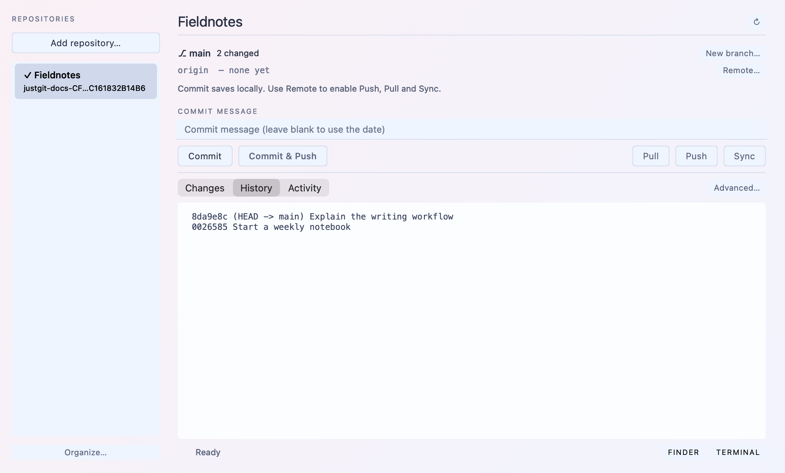
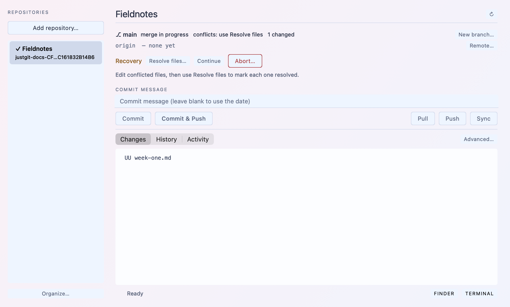

# JustGit

Look for this icon when opening **JustGit**. On Mac, its monochrome branch mark appears in the menu bar.

**Open a folder. Commit your work. Sync when ready.**

A compact Git app with history, conflict recovery, and editable appearance codes.
Mac: menu-bar panel. Windows: desktop window. **Version 1.0.0.**

**Targets:** macOS 11+ · Intel & Apple silicon · Windows 10/11 x64

## Start

1. **Run:** open `JustGit.app` on Mac or extract the full Windows portable folder
   and open `JustGit.exe`. Git must be installed.
2. **Add repository:** choose a local folder. Use the left sidebar to switch projects. For a new project, choose **Initialize repository**.
3. **Settings:** save your Git name and email. On Mac, right-click the menu-bar icon;
   on Windows, use the top menu.
4. **Commit:** review Changes and enter a message. This saves **all changes**, including
   untracked files that Git does not ignore. A blank message uses the date and time.
5. **Remote:** set `origin` to enable Push, Pull, and Sync. Local commits need no remote.

Use **Organize…** in the sidebar to create/rename/delete groups, move a repository
to a group, and move repositories or groups up/down. Organization is saved locally;
these actions never move or delete repository files.

Switching gives immediate feedback and a brief transition when content is ready.
Rapid selections open the latest choice; commit-message drafts stay with each
repository during the session. System reduced-motion settings are respected.

To use an online repository, clone it with Git first, then open its folder here.

| Action | Result |
| --- | --- |
| **Commit** | Save a local snapshot. |
| **Commit & Push** | Save, then upload. |
| **Push** | Upload the current branch to `origin`. |
| **Pull** | Fetch and rebase; autostash tracked edits. |
| **Sync** | Commit → pull → push; stop on failure. |
| **Refresh** | Read status without changing configuration. |

**Changes** shows pending files. **History** shows recent commits. **Activity** shows
command results and recovery references. The footer confirms successful actions.

## Recovery

| Situation | Next step |
| --- | --- |
| Push/Pull unavailable | Set **Remote**; use **New branch** if HEAD is detached. |
| Identity or SSH failure | Check **Settings**. Add your public key to your Git host. |
| Conflicts | Edit files → **Resolve files** → **Continue**. **Abort** cancels the operation and discards resolution edits. |
| Stash conflicts without an active operation | Resolve files and **Commit**; the stash is retained. |
| Pull would overwrite ignored files | Move or back up those files outside the repository, then retry. |
| Repository unavailable | Check the folder and permissions, then Refresh. |

**Advanced** contains Squash and force operations. Squash requires a clean tree and
complete history and creates a backup branch. Force Push previews remote-only
commits and offers a protected lease. Force Pull saves a backup and any local files
in a stash, including ignored files, before resetting. Recovery references remain
in Activity. Avoid concurrent changes from another Git tool during an operation.

## Appearance

Open **Settings → Edit style code** or the **Appearance** menu.

**Opal** pairs soft pink and blue surfaces with crisp, readable text and a subtle
frosted finish. A matching dark palette is included.

**Automatic** is the default for new installations and follows the system’s
light/dark setting while the app is running. Choose a preset or apply custom code
to keep a fixed appearance. Existing saved styles are preserved.

**Copy code** to edit JSON yourself, or **Copy for LLM** for code plus instructions.
Use **Paste & Apply**, or edit in place and press **Apply**. Colors, text colors,
fonts, and font sizes update immediately and persist after restart. **Reset to automatic**
returns to the system appearance. Layout, control order, and behavior are not editable.

Invalid JSON leaves the current appearance unchanged. Unsupported keys are
reported; missing fonts use a fallback. Copy code from the platform you are styling.

## Install & build

| Platform | Requirements | From source |
| --- | --- | --- |
| Mac | Apple Git command-line tools | Swift 5.7+ and a compatible SDK; run `Build.command` |
| Windows x64 | Git for Windows on PATH | Python 3.11+ with Tcl/Tk; run `Run-Windows.cmd` |

Mac packages include Intel and Apple silicon binaries. Build on a newer Mac for
Big Sur. Windows packages need no separate Python installation; keep the full
portable folder together. No Windows 32-bit or native ARM package is provided.

Mac builds are ad-hoc signed, without notarization; Windows executables are unsigned.
OS security warnings may appear. Big Sur and Windows 10 are deployment targets;
verification on those exact OS versions remains outstanding.

[Build, tests & releases](docs/DEVELOPMENT.md) · [Release downloads](https://github.com/jing1ei/JustGit/releases)

Mac shortcuts: **⌘O** Open, **⌘R** Refresh, **⌘Return** Commit & Push.
Windows: **Ctrl+O**, **Ctrl+R**, **Ctrl+Enter**. On Mac, click the menu-bar icon to
show/hide the panel and right-click to quit; there is no Dock icon.

Screenshots use native macOS controls and a disposable sample repository.

## Licence

All rights reserved. Use, modification, and redistribution require prior written
permission from the applicable copyright holder(s). See [LICENCE](LICENCE).

## Automatic downloads

Every successful build from a push to `main` refreshes the public **1.0.0** release.
All required platform builds and checks must pass first. Downloads use
`App-1.0.0-OS-architecture.ext`, such as `App-1.0.0-macOS-universal.zip`
or `App-1.0.0-Windows-x64.exe`. See [release automation](.github/RELEASES.md)
for the exact packages, checksums, and retry behavior.
